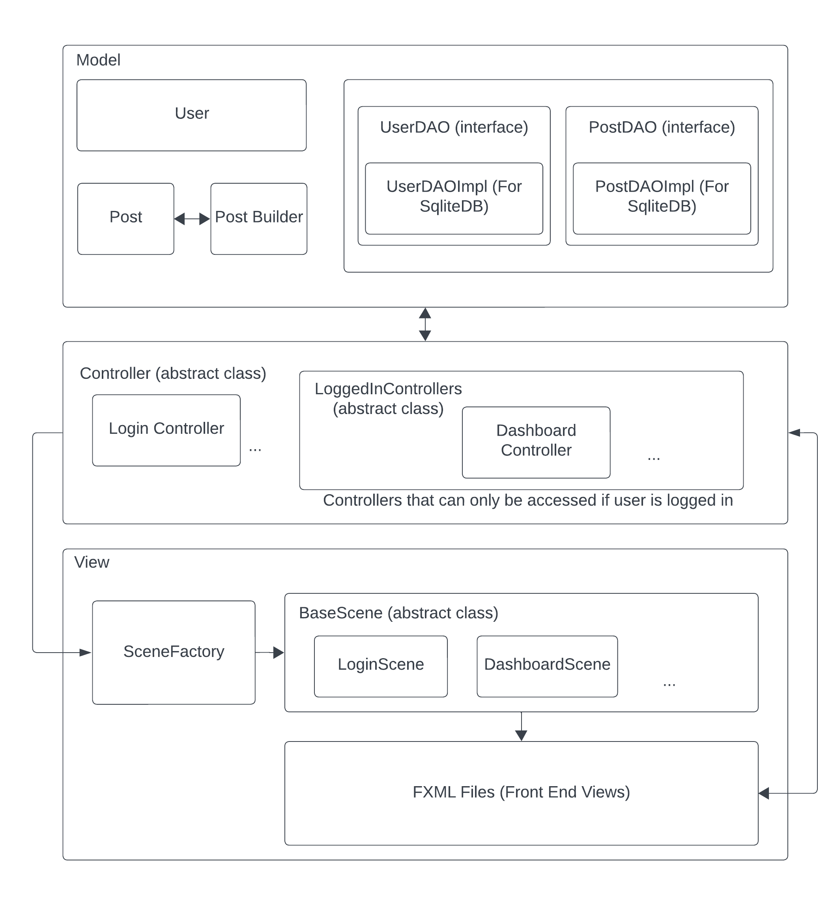

# Data Analytics Hub

This application provides an intuitive and user-friendly interface for managing user accounts, posts, and more.

## Key Features
- User Management: Create, update, and authenticate user accounts.
- Post Creation: Share your thoughts by creating and managing posts.
- Data Analysis: Analyze user data and posts for valuable insights.
- Custom Exceptions: Our application handles errors gracefully with custom exception handling.
- Extensible Design: We've designed the application with modularity in mind, allowing for easy expansion in the future.

## Architecture

It uses a MVC pattern to decouple front end views with database models.
Data is stored in a sqlite database.
Uses Factory design pattern to create views from controller.
Uses Builder design patter to create posts.




## Compiling and runnning through commandline
To use the Social Media Analyzer project, follow these steps:

Compile: Compile the Java classes using a Java compiler.

Compiling the Main.java file will compile the rest of the files.

**NOTE: Make sure you are on the root directory of the project before running the program.** 

To compile the Main.java file
```
javac src/Main.java
```
To run the compiled file:
```
java src/Main.java
```

## Unit Test Cases

The project also contains unit test cases. To run the unit test cases from the command line, compile the test files using the following command:

**NOTE: Make sure you are on the root directory of the project before running the program.** 

```
javac -cp lib/junit-4.13.2.jar:lib/hamcrest-core-1.3.jar:. src/Tests/TestUtils.java src/Tests/TestPost.java src/Tests/TestPostCollection.java src/Tests/TestTerminalMenu.java
```
To run the compiled test cases run the following command
```
java -cp lib/junit-4.13.2.jar:lib/hamcrest-core-1.3.jar:. org.junit.runner.JUnitCore src.Tests.TestUtils src.Tests.TestPost src.Tests.TestPostCollection src.Tests.TestTerminalMenu
```
Please make sure the whole command is in one line in the terminal before running.

## Static CSV Files

The project uses static csv files which are present in the resources folder. The project uses these files to run a few unit test cases.